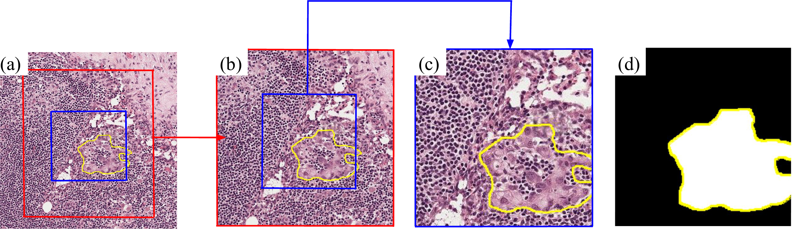

# Patch Extraction

This section if for users who wish to run the patch extraction code themselves on the original Camelyon16  
WSI slides. 

All code was tested on Ubuntu version 24.04.4 and using the Pycharm IDE. Note, no GPU is required for this code.
The code is primarily Python and some bash scripts. The installation time is about 10 hours, this includes downloading 
the 400GB Camelyon16 dataset.  Running the patch extraction code takes about 32 hours for a single thread with 40GB. 

Each thread should have about 35-40 GB of RAM. The number of threads can be found in submit_patch_job.sh 

# Download Camelyon16 dataset

Only the Camelyon16 dataset is needed, you can download it from [here](https://camelyon17.grand-challenge.org/Data/).

To download the Camelyon16, use the following commands, this requires the "aws" command to be installed. instructions are here:

```bash
mkdir ./c16slides/
aws s3 cp --no-sign-request s3://camelyon-dataset/CAMELYON16/ ./c16slides/ --recursive
```
The file structure for the downloaded dataset looks like:
* ./annotations/
* ./background_tissue/
* ./evaluation/
* ./images/
* ./masks/


We will make the structure look like:
* slidedata
  * annotations
  * normal
  * tumor

```bash
mkdir ./slidedata/
chmod +x ./move_data.sh 
./move_data.sh
```

# Setup virtual environment

We recommend sitting up a second virtual environment for the path extraction.

```bash
python3 -m venv ./datavenv
source ./datavenv/bin/activate
pip install -r requirements_patchextract.txt
pip install -e .
```


# Running the patch generation code

In order to run the patch generation code, some file paths need to be defined.

First, edit the parameters.py script, specifically the base_dir_output variable. This can be any path on your computer
and will contain the output slide level masks, patches, and maps.

Second, in submit_patch_job.sh you can leave the default variable FINAL_DIR or change it to whatever you like.
Then the MASK_LVL3 variable needs to be the same file path as the base_dir_output you defined in step one.

Now run the following command:
```bash
chmod +x ./submit_patch_job.sh 
./submit_patch_job.sh
```
That's all you need to do to generate a new set of patches. More detailed explanations about the dataset are below:

-**_Slide:_** The entire slide image these are tif files (> 1GB or more), They contain multiple resolutions, also called
levels. They are too large for a neural network input

-**_Level:_** Each slide contains multiple levels of resolution,
- Level 0: is the full resolution, this is the full entire slide image
- Level 1: reduced magnification by a factor of 4
- Level 2: reduced magnification by a factor of 16
- Level 3: reduced magnification by a factor of 32

-**_Patch:_** a small image that is a subset of a slide, typically 224 x 224 RGB. All patches are square and the center 
coordinates of the patch are resembled by (ci,cj) where ci corresponds to the x-axis and cj correspond to the y-axis. 
This is the center of the square. For example, the patch start column is ci-(224/2)
the patch end col is = ci + (224/2). Patch start row is cj - (224/2) and end row is cj+(224/2)

-**_Patch Mask:_** This is the binary mask of the patch which comes from the binary mask
for the entire tumor. Here white means tumor and black means not tumor. Note that
black does not imply normal tissue because the background may be included.

In the figure below, the red square is the level 3 patch and the blue square is the level 2 patch. The yellow polygon
marks the cancer region.


# License

Please see the attached MIT license. 

# Citation

Once published, citation add here. 