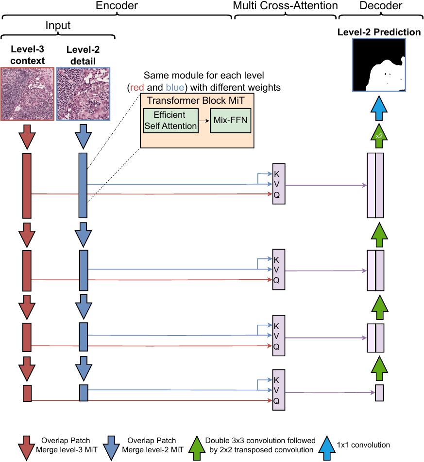

# Context Guided Segmentation Network
This readme contains the code for the work entitled "Context-Guided Segmentation for Histopathologic Cancer Segmentation." The instructions for running both CGS-Net and 
single network model inference and model training are within this readme. See the PatchExtract [readme](./PatchExtract/README.md).
for the patch generation code. We included our train/val/test data split patches, and they are publicly available [here](https://web.eece.maine.edu/~zhu/CGS_Data/)

These models were developed and ran on Nvidia A100-SXM4-40GB and A100 80GB GPUs. However, we tested running the code on a computer with a GeForce RTX 3070 Ti GPU
using a batch size of 8. All code was tested on Ubuntu version 24.04.4 with Nvidia driver version 535.171.04 and CUDA version 12.2, and Pycharm IDE.
The code is primarily Python and some bash scripts. The installation time for running the demo is about 1.5 hours (depending on your download speed).



# File Hierarchy 

Below is what your file hierarchy should look like as you move through this readme.

* data/
* dlp/
* PatchExtract/
* weights/
* results/
* slidedata/
* setup.py
* submit_cgs.sh
* submit_patch_job.sh
* submit_single_input.sh
* top_caller_patches.py
* requirements.txt
* requirements_patchextract.txt

# Data and Weight Download 

The following commands will download the zipped data and unzip it:

```bash
mkdir data 
wget https://web.eece.maine.edu/~zhu/CGS_Data/test_data.zip -P ./data/
wget https://web.eece.maine.edu/~zhu/CGS_Data/train_data.zip -P ./data/
wget https://web.eece.maine.edu/~zhu/CGS_Data/val_data.zip -P ./data/
unzip -q ./data/test_data.zip -d ./data
unzip -q ./data/train_data.zip -d ./data
unzip -q ./data/val_data.zip -d ./data
```

We now need to make the combined train and validation datasets called trainval,

```bash
mkdir ./data/trainval_images_lv2/
mkdir ./data/trainval_masks_lv2/
mkdir ./data/trainval_images_lv3/
mkdir ./data/trainval_masks_lv3/

cp -a ./data/train_images_lv2/. ./data/trainval_images_lv2/
cp -a ./data/val_images_lv2/. ./data/trainval_images_lv2/
cp -a ./data/train_masks_lv2/. ./data/trainval_masks_lv2/.
cp -a ./data/val_masks_lv2/. ./data/trainval_masks_lv2/.
# make the combined trainval for level 3
cp -a ./data/train_images_lv3/. ./data/trainval_images_lv3/.
cp -a ./data/val_images_lv3/. ./data/trainval_images_lv3/.
cp -a ./data/train_masks_lv3/. ./data/trainval_masks_lv3/.
cp -a ./data/val_masks_lv3/. ./data/trainval_masks_lv3/.
```

Your data folder should look like the following

* data
    * test_images_lv2
    *	test_images_lv3
    *	test_masks_lv2
    *	test_masks_lv3
    * train_images_lv2 
    * train_images_lv3 
    * train_masks_lv2 
    * train_masks_lv3 
    * trainval_images_lv2 
    * trainval_images_lv3 
    * trainval_masks_lv2
    * trainval_masks_lv3 
    * val_images_lv2 
    * val_images_lv3 
    * val_masks_lv2
    * val_masks_lv3

For the weights run the following commands

```bash
mkdir weights
wget https://web.eece.maine.edu/~zhu/CGS_Data/weights.zip -P ./weights/
unzip -q ./weights/weights.zip -d ./weights/
```

# Setup virtual environment

For this installation guide, we assume a python virtual environment, however you are more than welcome to use
your preferred environment. 

```bash
python3 -m venv ./venv
source ./venv/bin/activate
pip install -r requirements.txt
pip install -e .
```

# Available models
Two separate encoder architectures were used the Mixed Vision Transformer (MiT) and the Swin V2. 
For more information on MiT here is a [link](https://arxiv.org/abs/2105.15203) to the paper and [link](https://arxiv.org/abs/2111.09883) for the Swin V2 paper.


| Model                 | Parameter count (M) | AUC                 |
|-----------------------|---------------------|---------------------|
| Single MiT-B1         | 15.14               | 0.976 ± 0.0008      |
| Single MiT-B2         | 26.18               | 0.972 ± 0.002       |
| CGS-Net MiT-B1        | 30.08               | **0.9806 ± 0.0002** |
| CGS-Net MiT-B2        | 52.17               | **0.979 ± 0.0006**  |
| Single Swin V2 Tiny   | 29.56               | 0.971 ± 0.0009      |
| Single Swin V2 Small  | 50.92               | 0.967 ± 0.0097      |
| CGS-Net Swin V2 Tiny  | 60.81               | **0.974 ± 0.0015**  |
| CGS-Net Swin V2 Small | 103.54              | **0.976 ± 0.0008**  |


The weights for all of these models are provided in weights.zip.

# Demo of Inference

Here we run inference on a pretrained CGS-Net MiT-B1 model and see the output statistics and some model predictions. 
The script submit_cgs.sh has the training code commented out, and you can run the following commands:

```bash
mkdir ./results/
chmod +x ./submit_cgs.sh
./submit_cgs.sh
```
This script will run the model on the entire test data set which consists of 5180 224x224 patches. Visit the results 
directory to see the model predictions and the output statistics are printed to the terminal screen.

The estimated time to run the inference demo using a GeForce RTX 3070 Ti GPU for the models:

| Model                 | inference time | 
|-----------------------|----------------|
| Single MiT-B1         | 2m15s          |
| Single MiT-B2         | 2m15s          |
| CGS-Net MiT-B1        | 2m37s          |
| CGS-Net MiT-B2        | 2m42s          |
| Single Swin V2 Tiny   | 2m14s          |
| Single Swin V2 Small  | 2m27s          |
| CGS-Net Swin V2 Tiny  | 2m41s          |
| CGS-Net Swin V2 Small | 2m57s          |

# Training and testing a model 

The process to run a CGS-Net model and single input model is very similar. To train CGS-Net using the provided weights,
you can modify submit_cgs.sh. 

The following run uses the weights from two separate single MiT-B1 runs. CGS-Net uses the weights from the encoder and 
decoder of the level-2 run and the weights from the encoder of the level-3 run. These weights are from the combined train
and validation dataset. These weights have been provided to you, however you can run the individual models with the
submit_single_input.sh. You can then specify the path to the weights of the models you ran in dlp/models/model.py. 

The bash scripts include all the code necessary to train and test the models. The graphing and training code has been commented
out in submit_cgs.sh and submit_single_input.sh, uncomment the code to have the full training procedure. Be sure to 
change the weights to "trainval_single" since we are training the CGS-Net. The last item to update is the 
test_analysis.py script. You need to uncomment main() and comment out only_test_data(). This was done for the demo. 

The estimates for the complete training procedure and testing on an A100 GPU are:

| Model                 | full train and test time | 
|-----------------------|--------------------------|
| Single MiT-B1         | 99h18m                   |
| Single MiT-B2         | 109h38m                  |
| CGS-Net MiT-B1        | 51h30m                   |
| CGS-Net MiT-B2        | 53h18m                   |
| Single Swin V2 Tiny   | 91h21m                   |
| Single Swin V2 Small  | 89h44m                   |
| CGS-Net Swin V2 Tiny  | 73h7m                    |
| CGS-Net Swin V2 Small | 73h7m                    | 


# License

Please see the attached MIT license. 

# Citation

```
@article{juybari2025cgs,
  title={Context-Guided Segmentation for Histopathologic Cancer Segmentation},
  author={Juybari, Jeremy and Hamilton, Josh and Chen, Chaofan and Khalil, Andre and Zhu, Yifeng},
  journal={Sci Rep},
  year={2025}
}
``` 
